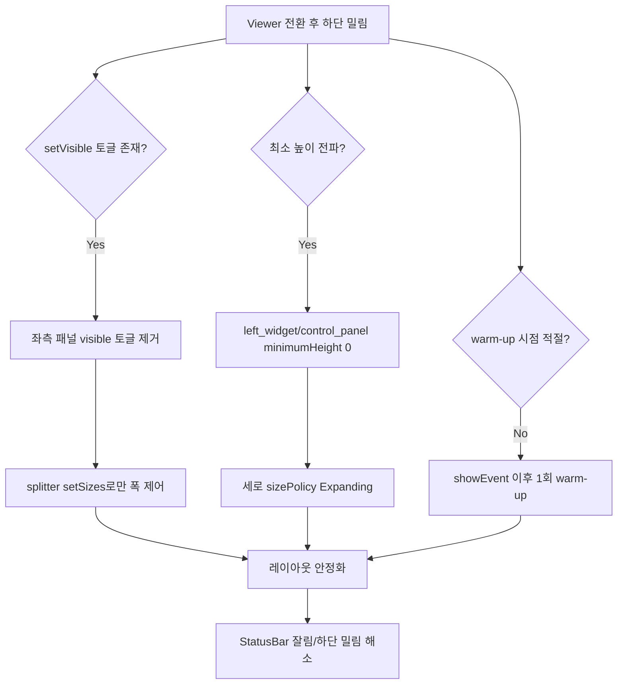

# Viewer 모드 하단 밀림 트러블슈팅 기록

## 1) 문제 요약

- 증상: 최대화 상태에서 `Viewer` 모드 전환 후(특히 `Viewer -> 원래 모드`), 전체 UI가 아래로 밀려 `StatusBar`가 잘려 보임.
- 특징:
  - 한 번 밀린 뒤에는 추가로 더 크게 변하지 않는 경우가 많았음.
  - 창 우상단의 `최대화/복원` 버튼을 수동으로 왕복하면 정상 위치로 돌아옴.
  - `Maker` 모드 전환에서는 같은 현상이 거의 재현되지 않음.

## 2) 재현 조건 (당시)

1. 앱 실행 후 창 최대화
2. `Viewer` 버튼 ON
3. `Viewer` 버튼 OFF
4. 하단 바(`User/Viewer/Maker` 표시 줄)가 아래로 밀리거나 잘려 보임

## 3) 지금까지 시도했던 것들 (실패/부분 실패 포함)

아래는 실제로 순차 시도한 항목들입니다.

### A. 로고/헤더 영역 관련 시도 (레이아웃 영향 탐색)

- `setCornerWidget` 사용
- 탭 콘텐츠 상단에 branding bar 삽입
- `main_tab` 오버레이 방식
- `tabBar` 오버레이 방식
- 최종적으로 `QMainWindow` 오버레이 방식으로 이동

결과:
- 로고 위치 문제는 해결됐지만, `Viewer` 전환 시 하단 밀림의 핵심 원인은 아니었음.

### B. Viewer UI 구조 변경 시도

- 좌/우 패널을 재배치(아래쪽 이동 포함), 위젯 reparent/remove/insert 수행
- `Basler/Inspection` 위치를 바꾸는 다양한 레이아웃 스왑

결과:
- 화면 소실/비정상 리사이즈/복귀 실패 등 부작용 발생.
- 동적 reparent가 클수록 Qt 레이아웃 캐시 문제를 더 자주 유발.

### C. geometry 강제 갱신 시도

- `updateGeometry()` 다수 호출
- `QApplication.processEvents()` 강제 처리
- `QTimer.singleShot(0, ...)`로 splitter 복원 지연
- 최대화 상태에서 `showNormal() -> showMaximized()` 강제 시퀀스

결과:
- 일부 케이스에서 일시 완화되었지만,
- 깜빡임/사용자 체감 저하가 있었고 재현이 완전히 사라지지 않음.

### D. 정보 라벨 이동 방식 변경

- 기존: `Position/GrayValue/Tact` 라벨을 레이아웃 간 이동
- 변경: Viewer 전용 복제 라벨(`_viewer_info_widget`) 생성 후 show/hide만 수행

결과:
- reparent 부작용은 줄었지만 하단 밀림이 완전히 사라지지는 않음.

### E. 중앙 높이 고정 후 해제 방식

- 모드 전환 전 `centralWidget` 높이 고정
- 전환 후 타이머로 높이 제한 해제

결과:
- 밀림 시점만 바뀌는 현상이 있었고, 완전 해결은 실패.

### F. 초기 pre-warm (init 시점 hide/show)

- `init_ui()`에서 Viewer 토글 대상 위젯을 미리 hide/show

결과:
- `window.show()` 이전 warm-up이라 실제 표시 상태의 스타일/sizeHint와 불일치 가능.
- 환경에 따라 재현 남음.

## 4) 최종 해결 전략 (성공)

핵심은 **세로 레이아웃 재계산을 유발하는 토글을 줄이고, 폭 제어는 스플리터로만 처리**하는 것이었습니다.

### 적용한 최종 변경

1. `left_panel.setVisible(False/True)` 제거  
   - `Viewer` ON/OFF에서 좌측 패널은 숨기지 않고, `QSplitter` 사이즈만 변경:
   - ON: `setSizes([0, main, right])`
   - OFF: 저장한 사이즈 복원

2. 스플리터 접힘 허용  
   - `splitter.setCollapsible(0, True)` 적용
   - 좌측 패널(인덱스 0)을 폭 0으로 안전하게 접을 수 있게 설정

3. 최소 높이 전파 차단  
   - 중앙/우측 패널에 `setMinimumHeight(0)` 적용
   - 세로 정책을 `Expanding`으로 지정해 특정 그룹의 `minimumSizeHint`가 창 전체 높이를 밀어 올리지 않도록 조정

4. warm-up 시점 이동  
   - `init_ui()` 즉시 warm-up 제거
   - `showEvent` 이후 1회(`QTimer.singleShot(0, ...)`) warm-up 수행
   - 실제 표시 상태에서 `sizeHint` 안정화

## 5) 왜 이번에는 해결됐는가

- 이전 실패의 공통점은 `visible 토글 + 동적 레이아웃 재배치 + 시점 불안정` 조합이었음.
- 이번 해결은:
  - 폭 변경은 `splitter` 하나로 제한 (예측 가능)
  - 세로 최소 높이 전파를 억제 (하단 밀림 차단)
  - warm-up을 실제 표시 이후 1회로 고정 (초기 hint 불일치 제거)
- 즉, Qt가 첫 토글 때 계산하던 비결정적인 `sizeHint/minimumSizeHint` 변화를 실질적으로 봉쇄.

## 6) 변경 포인트 요약 (파일)

- `src/ui/main_window.py`
  - `_apply_mode()`:
    - 좌측 패널 `setVisible` 토글 제거
    - splitter size 기반 접기/복원으로 통일
  - `init_ui()`:
    - splitter에 `setCollapsible(0, True)` 추가
    - 중앙/우측 패널 최소 높이 및 size policy 보강
    - 즉시 pre-warm 제거
  - `showEvent()` + `_post_show_layout_warmup()`:
    - 표시 후 1회 레이아웃 warm-up 도입

## 7) 의사결정 흐름 (Mermaid)

## 8) 재발 방지 가이드

- Viewer 같은 모드 전환에서:
  - 가능한 `setVisible` 남발보다 `QSplitter.setSizes` 기반으로 제어
  - 위젯 reparent/remove/insert 최소화
  - `minimumHeight`/`minimumSizeHint` 전파를 먼저 점검
- 첫 토글에서만 깨지는 문제는 `showEvent` 이후 1회 warm-up으로 대응
- geometry 강제(`showNormal/showMaximized`)는 최후의 수단으로만 사용

## 9) 검증 체크리스트

- [ ] 최대화 상태에서 Viewer ON/OFF 10회 반복
- [ ] Maker ON/OFF 후 Viewer ON/OFF 교차 10회
- [ ] 탭 전환(Main/Classification) 포함 후 Viewer ON/OFF
- [ ] 상태바 잘림/하단 밀림/창 위치 점프 없음 확인

